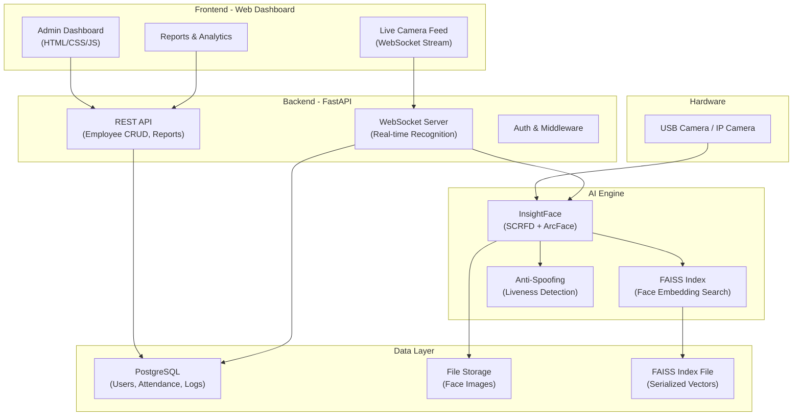
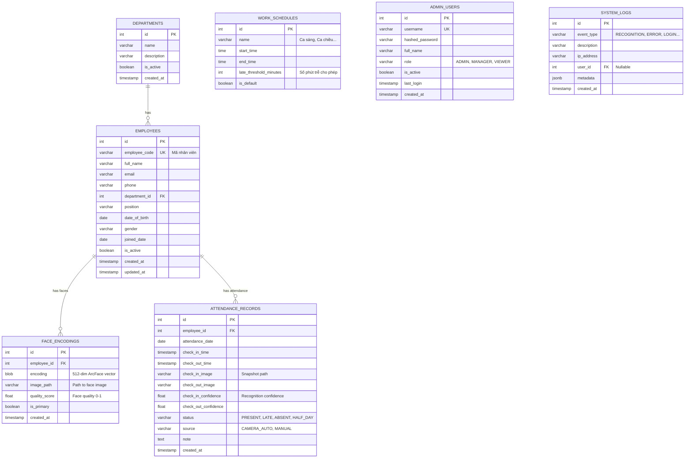
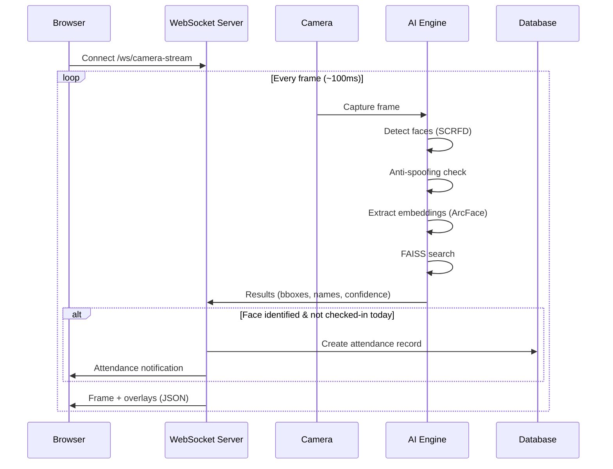

# FTA - Face Time Attendance System

Hệ thống chấm công nhân sự bằng nhận diện khuôn mặt cho doanh nghiệp nhỏ (~50 nhân viên).

---

## Tổng quan kiến trúc



---

## Tech Stack

| Component | Technology | Lý do chọn |
|:---|:---|:---|
| **Backend Framework** | FastAPI + Uvicorn | Async, hiệu suất cao, WebSocket native |
| **Face Detection** | InsightFace (SCRFD) | State-of-the-art, inference 15-20ms/frame |
| **Face Recognition** | InsightFace (ArcFace/Buffalo_L) | Accuracy >99.8% trên LFW benchmark |
| **Vector Search** | FAISS (IndexFlatL2) | Exact search, tối ưu cho <1000 users |
| **Anti-Spoofing** | MiniFASNet (via UniFace/Custom) | Chống giả mạo bằng ảnh/video |
| **Database** | PostgreSQL + SQLAlchemy | Robust, ACID compliant, production-ready |
| **ORM/Migration** | SQLAlchemy + Alembic | Type-safe ORM, DB versioning |
| **Frontend** | HTML5/CSS3/JavaScript (Vanilla) | Dashboard quản trị, không cần SPA framework |
| **Real-time Stream** | WebSocket + Canvas API | Live camera feed với face overlay |
| **Camera** | OpenCV (cv2.VideoCapture) | Hỗ trợ USB cam, IP cam (RTSP) |
| **Auth** | JWT (python-jose) | Bảo mật API |
| **Task Queue** | Background Tasks (FastAPI) | Đủ cho quy mô nhỏ, không cần Celery |

---

## User Review Required

> [!IMPORTANT]
> **Database Engine**: Plan mặc định sử dụng **PostgreSQL**. Nếu muốn đơn giản hóa setup, có thể dùng **SQLite** cho phase đầu và migrate sang PostgreSQL sau. Bạn muốn dùng cái nào?

> [!IMPORTANT]
> **Camera Setup**: Hệ thống hỗ trợ cả USB webcam và IP camera (RTSP). Bạn dự định dùng loại camera nào? Điều này ảnh hưởng đến cách config camera source.

> [!WARNING]
> **GPU vs CPU**: InsightFace chạy tốt trên CPU cho quy mô 50 người (inference ~50-80ms/frame trên CPU). Nếu có GPU NVIDIA, hiệu suất sẽ tăng lên ~15-20ms/frame. Bạn có GPU không?

---

## Open Questions

> [!IMPORTANT]
> 1. **Giờ làm việc**: Hệ thống có cần quản lý ca làm việc (shifts) không? Hay chỉ cần check-in / check-out đơn giản?
> 2. **Multi-camera**: Cần hỗ trợ bao nhiêu camera cùng lúc? (1 cổng vào hay nhiều vị trí?)
> 3. **Ngôn ngữ giao diện**: Dashboard bằng tiếng Việt hay tiếng Anh?
> 4. **Export báo cáo**: Cần xuất báo cáo dạng gì? (Excel, PDF, hoặc cả hai?)

---

## Cấu trúc dự án

```
d:\datworkspace\FTA\
├── app/
│   ├── __init__.py
│   ├── main.py                    # FastAPI entry point
│   ├── config.py                  # App configuration
│   │
│   ├── api/                       # API routes
│   │   ├── __init__.py
│   │   ├── auth.py                # Login/Logout/JWT
│   │   ├── employees.py           # Employee CRUD
│   │   ├── attendance.py          # Attendance records
│   │   ├── departments.py         # Department management
│   │   ├── recognition.py         # Face recognition endpoints
│   │   └── reports.py             # Reports & analytics
│   │
│   ├── models/                    # SQLAlchemy models
│   │   ├── __init__.py
│   │   ├── employee.py
│   │   ├── attendance.py
│   │   ├── department.py
│   │   └── user.py                # Admin users
│   │
│   ├── schemas/                   # Pydantic schemas
│   │   ├── __init__.py
│   │   ├── employee.py
│   │   ├── attendance.py
│   │   ├── department.py
│   │   └── auth.py
│   │
│   ├── services/                  # Business logic
│   │   ├── __init__.py
│   │   ├── face_recognition.py    # InsightFace wrapper
│   │   ├── face_index.py          # FAISS index management
│   │   ├── anti_spoofing.py       # Liveness detection
│   │   ├── attendance_service.py  # Attendance logic
│   │   ├── camera_service.py      # Camera capture management
│   │   └── report_service.py      # Report generation
│   │
│   ├── core/                      # Core utilities
│   │   ├── __init__.py
│   │   ├── database.py            # DB connection & session
│   │   ├── security.py            # JWT, hashing
│   │   └── dependencies.py        # FastAPI dependencies
│   │
│   └── websocket/                 # WebSocket handlers
│       ├── __init__.py
│       └── camera_stream.py       # Live recognition stream
│
├── frontend/                      # Web Dashboard
│   ├── index.html                 # Main dashboard
│   ├── login.html                 # Login page
│   ├── employees.html             # Employee management
│   ├── attendance.html            # Attendance records
│   ├── register_face.html         # Face registration
│   ├── live_monitor.html          # Live camera monitor
│   ├── reports.html               # Reports page
│   │
│   ├── css/
│   │   ├── style.css              # Main stylesheet
│   │   └── components.css         # Component styles
│   │
│   ├── js/
│   │   ├── app.js                 # Main app logic
│   │   ├── api.js                 # API client
│   │   ├── auth.js                # Auth handling
│   │   ├── camera.js              # Camera & WebSocket
│   │   ├── employees.js           # Employee management
│   │   ├── attendance.js          # Attendance views
│   │   └── reports.js             # Report generation
│   │
│   └── assets/
│       └── icons/                 # UI icons
│
├── data/                          # Data storage
│   ├── face_images/               # Registered face images
│   ├── faiss_index/               # FAISS index files
│   └── models/                    # AI model files (auto-downloaded)
│
├── migrations/                    # Alembic migrations
│   ├── versions/
│   └── env.py
│
├── tests/                         # Test suite
│   ├── test_recognition.py
│   ├── test_api.py
│   └── test_attendance.py
│
├── scripts/                       # Utility scripts
│   ├── init_db.py                 # Initialize database
│   ├── create_admin.py            # Create admin user
│   └── benchmark.py               # Performance benchmark
│
├── alembic.ini                    # Alembic config
├── requirements.txt               # Python dependencies
├── .env                           # Environment variables
├── .env.example                   # Env template
└── README.md                      # Project documentation
```

---

## Database Schema



---

## Proposed Changes (Chi tiết triển khai)

### Phase 1: Foundation & Core Setup

#### [NEW] [requirements.txt](file:///d:/datworkspace/FTA/requirements.txt)
```
# Core
fastapi==0.115.*
uvicorn[standard]==0.34.*
python-multipart==0.0.*
python-jose[cryptography]==3.3.*
passlib[bcrypt]==1.7.*
python-dotenv==1.1.*

# Database
sqlalchemy==2.0.*
alembic==1.16.*
psycopg2-binary==2.9.*      # PostgreSQL driver
# asyncpg==0.30.*            # Async PG driver (optional)

# AI / Face Recognition
insightface==0.7.*
onnxruntime==1.22.*          # CPU inference
# onnxruntime-gpu==1.22.*    # GPU inference (optional)
opencv-python==4.11.*
faiss-cpu==1.11.*
numpy==2.2.*
Pillow==11.*

# Utilities
pydantic[email]==2.11.*
pydantic-settings==2.9.*
aiofiles==24.*
openpyxl==3.1.*              # Excel export
jinja2==3.1.*                # HTML templates
```

#### [NEW] [.env.example](file:///d:/datworkspace/FTA/.env.example)
- Database connection string
- JWT secret key, algorithm, expiry
- Camera source config (USB index or RTSP URL)
- Face recognition thresholds
- Upload directories

#### [NEW] [app/config.py](file:///d:/datworkspace/FTA/app/config.py)
- Pydantic Settings class đọc từ `.env`
- Config cho database, JWT, camera, face recognition thresholds

#### [NEW] [app/core/database.py](file:///d:/datworkspace/FTA/app/core/database.py)
- SQLAlchemy engine & session factory
- `get_db()` dependency cho FastAPI

#### [NEW] [app/core/security.py](file:///d:/datworkspace/FTA/app/core/security.py)
- JWT token creation & validation
- Password hashing (bcrypt)

---

### Phase 2: Database Models & Schemas

#### [NEW] [app/models/](file:///d:/datworkspace/FTA/app/models/)
- SQLAlchemy models cho tất cả bảng trong schema trên
- Relationships, indexes, constraints

#### [NEW] [app/schemas/](file:///d:/datworkspace/FTA/app/schemas/)
- Pydantic models cho request/response validation
- Create, Update, Response schemas cho mỗi entity

#### [NEW] [migrations/](file:///d:/datworkspace/FTA/migrations/)
- Alembic setup với initial migration

---

### Phase 3: AI Face Recognition Engine (Core)

> [!NOTE]
> Đây là phần quan trọng nhất, ảnh hưởng trực tiếp đến performance.

#### [NEW] [app/services/face_recognition.py](file:///d:/datworkspace/FTA/app/services/face_recognition.py)

**Pipeline nhận diện:**
```
Camera Frame → SCRFD Detection → Face Alignment → ArcFace Embedding (512-dim) → FAISS Search → Identity Match
```

- Khởi tạo InsightFace model (`buffalo_l`) khi startup
- `detect_faces(frame)` → trả về danh sách faces với bounding boxes
- `extract_embedding(face)` → trả về vector 512 chiều
- `identify(frame)` → end-to-end: detect → embed → search → return identities
- Face quality assessment (blur, angle, lighting)

#### [NEW] [app/services/face_index.py](file:///d:/datworkspace/FTA/app/services/face_index.py)

**FAISS Index Management:**
- `IndexFlatL2` cho exact search (tối ưu cho ≤1000 users)
- `build_index()` → load tất cả embeddings từ DB, build FAISS index
- `search(embedding, threshold)` → tìm nearest neighbor, return employee_id + distance
- `add_face(employee_id, embedding)` → thêm face vào index
- `remove_face(employee_id)` → xóa face khỏi index
- `save_index()` / `load_index()` → persist index to disk
- Auto-rebuild index khi startup

**Chiến lược matching:**
- Cosine similarity threshold: **0.4** (distance < 0.4 = match)
- Nếu distance > 0.4 → "Unknown face"
- Top-1 match với confidence score

#### [NEW] [app/services/anti_spoofing.py](file:///d:/datworkspace/FTA/app/services/anti_spoofing.py)

**Liveness Detection (Anti-Spoofing):**
- Sử dụng MiniFASNet hoặc custom model
- Phân biệt: real face vs printed photo vs screen display
- Confidence score cho liveness
- Có thể bổ sung blink detection (MediaPipe) như layer phụ

#### [NEW] [app/services/camera_service.py](file:///d:/datworkspace/FTA/app/services/camera_service.py)
- OpenCV VideoCapture wrapper
- Hỗ trợ USB cam (index 0, 1, ...) và IP cam (RTSP URL)
- Frame capture, resize, preprocessing
- Camera health check & auto-reconnect

---

### Phase 4: API Endpoints

#### [NEW] [app/api/auth.py](file:///d:/datworkspace/FTA/app/api/auth.py)
| Method | Endpoint | Mô tả |
|:---|:---|:---|
| POST | `/api/auth/login` | Đăng nhập, trả JWT |
| POST | `/api/auth/logout` | Đăng xuất |
| GET | `/api/auth/me` | Thông tin user hiện tại |
| PUT | `/api/auth/change-password` | Đổi mật khẩu |

#### [NEW] [app/api/employees.py](file:///d:/datworkspace/FTA/app/api/employees.py)
| Method | Endpoint | Mô tả |
|:---|:---|:---|
| GET | `/api/employees` | Danh sách nhân viên (pagination, filter) |
| POST | `/api/employees` | Thêm nhân viên mới |
| GET | `/api/employees/{id}` | Chi tiết nhân viên |
| PUT | `/api/employees/{id}` | Cập nhật thông tin |
| DELETE | `/api/employees/{id}` | Xóa nhân viên (soft delete) |

#### [NEW] [app/api/recognition.py](file:///d:/datworkspace/FTA/app/api/recognition.py)
| Method | Endpoint | Mô tả |
|:---|:---|:---|
| POST | `/api/recognition/register` | Đăng ký khuôn mặt (upload ảnh) |
| POST | `/api/recognition/register-camera` | Đăng ký qua camera live |
| DELETE | `/api/recognition/face/{id}` | Xóa face encoding |
| POST | `/api/recognition/verify` | Verify 1 ảnh → identity |
| WS | `/ws/camera-stream` | WebSocket: live recognition stream |

#### [NEW] [app/api/attendance.py](file:///d:/datworkspace/FTA/app/api/attendance.py)
| Method | Endpoint | Mô tả |
|:---|:---|:---|
| GET | `/api/attendance` | Lịch sử chấm công (filter by date, employee) |
| GET | `/api/attendance/today` | Chấm công hôm nay |
| POST | `/api/attendance/manual` | Chấm công thủ công |
| GET | `/api/attendance/summary` | Tổng hợp theo tháng |

#### [NEW] [app/api/reports.py](file:///d:/datworkspace/FTA/app/api/reports.py)
| Method | Endpoint | Mô tả |
|:---|:---|:---|
| GET | `/api/reports/daily` | Báo cáo ngày |
| GET | `/api/reports/monthly` | Báo cáo tháng |
| GET | `/api/reports/export/excel` | Xuất Excel |
| GET | `/api/reports/dashboard-stats` | Thống kê cho dashboard |

---

### Phase 5: WebSocket - Real-time Camera Recognition

#### [NEW] [app/websocket/camera_stream.py](file:///d:/datworkspace/FTA/app/websocket/camera_stream.py)

**Flow:**


- Frame rate control: xử lý 10 FPS (đủ cho attendance, tiết kiệm CPU)
- Chỉ gửi frame đã annotated (bounding box + tên) về client
- Cooldown mechanism: không chấm công lại trong 30 phút cho cùng 1 người
- Buffer queue để tránh frame drop

---

### Phase 6: Frontend Web Dashboard

#### Design System
- **Theme**: Dark mode chính, glassmorphism cards
- **Color Palette**: Deep navy (#0f172a) + Electric blue (#3b82f6) + Emerald accents (#10b981)
- **Typography**: Inter (Google Fonts)
- **Animations**: Smooth transitions, micro-interactions
- **Layout**: Sidebar navigation + main content area
- **Responsive**: Hoạt động trên desktop & tablet

#### [NEW] [frontend/index.html](file:///d:/datworkspace/FTA/frontend/index.html) — Dashboard chính
- Thống kê tổng quan: Tổng NV, Đã check-in hôm nay, Đi trễ, Vắng mặt
- Biểu đồ attendance tuần/tháng
- Hoạt động gần đây (real-time feed)
- Quick actions

#### [NEW] [frontend/live_monitor.html](file:///d:/datworkspace/FTA/frontend/live_monitor.html) — Camera Monitor
- Live camera feed với face recognition overlay
- Bảng chấm công real-time (ai vừa check-in)
- Trạng thái hệ thống (camera, AI engine)

#### [NEW] [frontend/employees.html](file:///d:/datworkspace/FTA/frontend/employees.html) — Quản lý nhân viên
- Bảng danh sách NV (search, filter, pagination)
- Form thêm/sửa NV
- Đăng ký khuôn mặt (upload ảnh hoặc chụp từ camera)

#### [NEW] [frontend/attendance.html](file:///d:/datworkspace/FTA/frontend/attendance.html) — Chấm công
- Bảng chấm công theo ngày
- Calendar view theo tháng
- Filter theo phòng ban, nhân viên

#### [NEW] [frontend/reports.html](file:///d:/datworkspace/FTA/frontend/reports.html) — Báo cáo
- Báo cáo tổng hợp theo tháng
- Xuất Excel
- Biểu đồ thống kê

---

### Phase 7: Performance Optimizations

> [!TIP]
> Các chiến lược tối ưu hiệu suất cho recognition

| Strategy | Detail |
|:---|:---|
| **Model Loading** | Load InsightFace model 1 lần khi startup, giữ trong memory |
| **FAISS Index** | In-memory index, rebuild khi có thay đổi face data |
| **Frame Skip** | Xử lý 10 FPS thay vì full 30 FPS |
| **Face Tracking** | Track detected faces giữa frames, chỉ re-identify mỗi 5 frames |
| **Batch Processing** | Xử lý nhiều faces trong 1 frame cùng lúc |
| **Image Preprocessing** | Resize frame xuống 640x480 trước khi detect |
| **Cooldown Cache** | Cache kết quả recognition, không re-check trong 30 phút |
| **ONNX Runtime** | Sử dụng ONNX Runtime cho inference nhanh hơn |

**Hiệu suất dự kiến (CPU - Intel i5/i7):**
- Face Detection (SCRFD): ~30-40ms/frame
- Face Embedding (ArcFace): ~20-30ms/face
- FAISS Search (50 users): <1ms
- **Total pipeline: ~60-80ms/face** (đủ real-time 10+ FPS)

---

## Kế hoạch triển khai theo phases

| Phase | Nội dung | Thời gian ước tính |
|:---|:---|:---|
| **Phase 1** | Project setup, config, database connection | ~1 session |
| **Phase 2** | Database models, schemas, migrations | ~1 session |
| **Phase 3** | AI Engine (InsightFace + FAISS + Anti-spoof) | ~2 sessions |
| **Phase 4** | REST API endpoints | ~2 sessions |
| **Phase 5** | WebSocket real-time recognition | ~1 session |
| **Phase 6** | Frontend dashboard (all pages) | ~3 sessions |
| **Phase 7** | Optimization, testing, polish | ~1 session |

---

## Verification Plan

### Automated Tests
- Unit tests cho face recognition service (accuracy, threshold)
- API tests cho tất cả endpoints (CRUD, auth)
- Performance benchmark script (FPS, latency)
- Integration test: end-to-end recognition → attendance logging

### Manual Verification
- Test với camera thật, chụp nhiều góc, ánh sáng khác nhau
- Test anti-spoofing với ảnh in, ảnh trên điện thoại
- Test với nhiều người cùng lúc trong frame
- Test dashboard UI trên Chrome/Firefox
- Test export báo cáo Excel

### Performance Benchmarks
```bash
python scripts/benchmark.py --faces 50 --frames 100
# Target: >10 FPS on CPU, >99% accuracy at threshold 0.4
```
